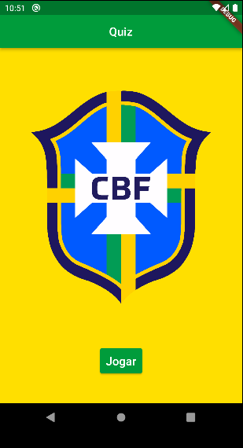
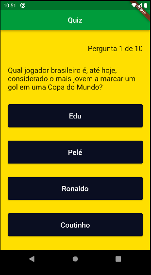
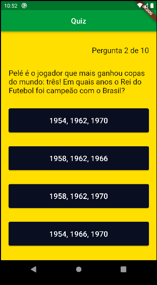
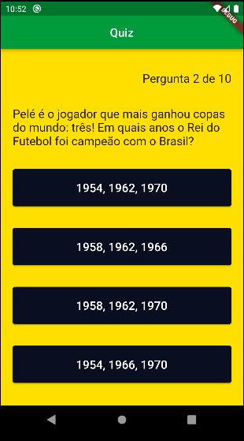

### Projeto Quiz

Um projeto bem simples feito em Flutter, o aplicativo realiza perguntas aleatórias sobre a seleção brasileira de futebol, no final o aplicativo vai informar quantas perguntas respondeu corretamente. 

Visualização do projeto:

  
  
  
  

